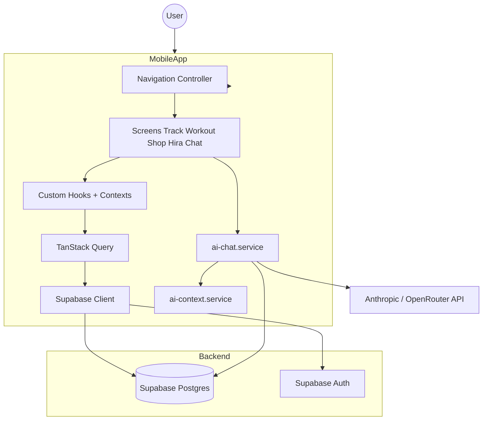

# Hira-AI — Project Summary

## Purpose

**Hira-AI** is a monorepo for a comprehensive health-tracking and AI coaching product.

- **Mobile app**: React Native + Expo (TypeScript).
- **Backend**: NestJS (currently scaffold).
- **Database/Auth**: Supabase (PostgreSQL + Auth).

The project is a high-performance, design-system–driven mobile application focused on tracking workouts, nutrition, and sleep, with an integrated AI wellness coach (Hira) and marketplace.

---

## Project State

### Mobile (`apps/mobile`)

**Status**: Active Development  
**Tech Stack**: React Native, Expo, TypeScript, TanStack Query, Supabase Client, design tokens (`theme.ts`: colors, space, typography, radius), expo-linear-gradient.

**Today tab**: The **Today** tab content is the **Workout Tracker** screen (`WorkoutTrackerScreen`) embedded in `TrackHomeScreen` — Move card (program CTA), Muscle intensity, My Workouts, marketplace. The old tracker-home layout (Move + Nourish + Sleep + Routines cards) is no longer shown on Today; other tabs (Buy, Hira, Connect, Profile) are unchanged. Back from Program, My Workouts, or Workout Insights (Muscle intensity) returns to the same origin (Today tab or standalone Workout screen) via `programReturnScreen`, `myWorkoutsReturnScreen`, and `workoutInsightsReturnScreen` in `App.tsx` (in-app and hardware back).

**Move card (Workout Tracker)**: When used as the program entry, the card shows **"Create your own program"** with no Start button and no time icon / "High intensity" subtitle (`NextWorkoutCard` props `hideSubtitle`, `hideCta`). Tapping the card navigates to the Program screen.
**Gamification (current state)**: **XP** is disabled in the app (no XP GAINED radial, no rank/XP on profile; hooks and DB tables remain for future use). **Streak** is shown on the tracker home header badge only.

**Implemented Features**:

1. **Authentication**
   - **Auth Flow**: Sign In / Sign Up screens (`AuthScreen`).
   - **Supabase Auth**: Persistent session with AsyncStorage.
   - **Onboarding**: `OnboardingScreen` for new users (name, DOB, gender, height/weight). Step 3 "Your metrics" uses white "metrics" text; height and weight are **text inputs** with unit toggles (cm/in, kg/lbs), committed on blur and on submit; validation and storage in cm/kg. Profile and health context via `ProfileContext`.

2. **Navigation**
   - **Core**: State-based navigation in `App.tsx`.
   - **Main Tabs**: `TrackHomeScreen` with tabs: **Buy** (Shop), **Today** (Workout Tracker content), **Hira** (AI Chat), **Connect** (Community), **Profile**. Bottom tab bar uses `BottomTabBar` + `TabItem` with per-tab animation (Reanimated) and white active state. **Today** tab renders `WorkoutTrackerScreen` (no back button when embedded); standalone Workout Tracker is reachable when `currentScreen === 'workout'` and shows a back button to track.
   - **Return-screen pattern**: Opening **Program**, **My Workouts**, or **Workout Insights** from the Today tab stores return screen `'track'`; opening from the standalone Workout Tracker stores `'workout'`. Back (in-app and Android hardware back) uses the stored value so users return to the correct tab/screen.
   - **Screens**: Workout Tracker (hub), Program, Create Program, Template Create/Session, My Workouts, Workout History, Workout Insights (Muscle intensity), Nutrition, Sleep, Habit Tracker, Shop, Cart, Personal Info, Community, Create Post, and others.

3. **AI Chat (Hira)**
   - **AiChatScreen**: In-app AI wellness coach tab with greeting, quick-action cards (Log workout, Sleep tip, Macros, Start a meditation), and chat input.
   - **Backend**: `ai-chat.service.ts` — `createConversation(userId)`, `sendChatMessage(userId, conversationId, userMessage)`; supports Anthropic and OpenRouter APIs (key via `EXPO_PUBLIC_ANTHROPIC_API_KEY`).
   - **Context**: `ai-context.service.ts` builds user context (profile, workout, nutrition, sleep, memory) for personalized responses.
   - **Persistence**: Messages and conversations stored in Supabase (`ai_messages`, `ai_conversations`).

4. **Workout Tracking**
   - **Workout Hub**: `WorkoutTrackerScreen` — Move card (program CTA), Muscle intensity, My Workouts, marketplace. Shown as the **Today** tab content (no back button) and as a standalone screen (back to track). Move card taps go to Program; "See all" goes to My Workouts; Muscle intensity goes to Workout Insights; back from each returns to the originating screen/tab.
   - **Program**: `ProgramScreen`, `CreateProgramScreen` — week-by-week schedule, assign templates to days, start program day sessions. **Create Program**: Title, description, periodisation (weeks), and **WEEKLY SCHEDULE** with 7 days (Mon–Sun). User assigns a workout template per day via a "Choose workout" modal (templates from `useWorkoutTemplates`). Selected days show the workout name in a **gradient pill** (same style as ProgramScreen); unselected show "Select workout." Tapping a day **with** a workout expands a **dropdown** listing that template's exercises (single line per exercise: name left, sets/reps right) and a "Change workout" button; tapping a day **without** a workout opens the modal. On Create, `day_assignments` are sent to `useCreateProgram`, which inserts into `workout_program_day_templates` so every week's matching day gets the chosen template.
   - **Template Builder**: `TemplateCreateScreen` for custom workouts.
   - **Session Logger**: `TemplateSessionScreen` for active workout tracking (accepts program id / program day id for completion linking).
   - **Exercise Search**: `ExerciseSearchScreen` with database-driven search.
   - **My Workouts**: `MyWorkoutsScreen`. **Workout Insights**: `WorkoutInsightsScreen` (Muscle intensity). **Activity Analytics**: `ActivityAnalyticsScreen` for steps/distance/pace.

5. **Nutrition Tracking**
   - **Dashboard**: `NutritionDetailsScreen` — calories, macros, daily summary.
   - **Meal Logging**: `AddMealScreen`, `FoodSearchScreen`; atomic logging via `log_meal` RPC and `useNutrition` / `NutritionContext`.
   - **Food Search**: Real-time search and filtering.

6. **Sleep & Recovery**
   - **Sleep Tracker**: `SleepTrackerScreen` for duration and quality.

7. **Habits (Routines)**
   - **Habit Tracker**: `HabitTrackerScreen` — weekly consistency view, MY HABITS grid (DB-driven), ADD HABIT card (no FAB). Create/Edit/Delete via `CreateHabitScreen`, `EditHabitScreen`; long-press menu on habit cards. **Habit Insights**: `HabitInsightsScreen`, `HabitDailyInsightsScreen` with local streak/rate utilities (`habitInsightsUtils.ts`).
   - **Data**: `user_habits`, `habit_completions` in Supabase; types in `types/habits.ts`; hooks in `useHabits.ts` (`useHabits`, `useHabitCompletions`, `useUpsertHabitCompletion`, `useCreateHabit`, `useUpdateHabit`, `useDeleteHabit`).
   - **Track home card (Routines)**: `HabitCard` in `OverviewCards.tsx` — label **ROUTINES** (violet), icon-first list (check/circle + truncated name, 10-char threshold + "..."), footer **"X of Y"** (completed of total). Up to 3 habits; data from same hooks, pre-processed in `TrackHomeScreen`.

8. **Profile & Health**
   - **Profile**: `ProfileScreen`, `PersonalInfoScreen`; `ProfileContext` for cached profile and health data. Profile screen content is **scrollable** (wrapped in `ScrollView` with bottom padding) so Integrations and Sign out are reachable; screen uses a **solid black background** (`colors.bgMidnight`); the previous purple-to-black gradient was removed. **Sign out**: Profile screen includes a Sign out button at the bottom; calls `supabase.auth.signOut()` (session cleared, app shows auth screens).
   - **Health Data Test**: `HealthDataTestScreen` (e.g. native health module integration).

9. **Marketplace (Shop)**
   - **Browse**: `ShopHomeScreen` — featured supplements, templates, categories.
   - **Cart**: `CartScreen` with `CartContext`, Supabase-backed cart, optimistic updates.

10. **Community Feed**
   - **CommunityScreen**: Feed with tabs **For You**, **Following**, **Trending**; full-width **Create Post** button below tabs; cursor-based pagination via `get_community_feed` RPC.
   - **CreatePostScreen**: New post flow — header (X, "New Post", Post), author + visibility dropdown (**Public** / **Friends**), content input, @ Tag Friends / # Tag Activity pills, AI Content Gen banner, media row (Photo, Video, Poll, Location, More). Submit via `useCreatePost`; visibility and media are UI-only for now.
   - **Post cards**: `CommunityPostCard` — avatar, author, Follow, type tag, body, media, tags, like/comment/share/bookmark. Like and Follow wired to `useLikePost`, `useFollowAuthor`.
   - **Data**: `useCommunityFeed` / `useCommunityFeedFlatItems` (infinite query), `useCommunityActions` (like, follow, comment, create post). Optional `useCommunityPostRealtime()` to invalidate feed on post count changes. Types in `types/community.ts`.

11. **Data & Services**
   - **Supabase**: Direct client usage with RLS.
   - **TanStack Query**: Caching and data fetching (`useWorkoutTemplates`, `useShopProducts`, `useFoodLibrarySearch`, `useCommunityFeed`, etc.).
   - **Services**: `ai-chat.service.ts`, `ai-context.service.ts`, `HealthService.ts`, `HealthNormalizer.ts`, offline-storage and meal-related logic.

### Backend (`apps/backend`)

**Status**: Scaffold / Early Stage  
**Tech Stack**: NestJS.  
- Basic structure present. Mobile uses Supabase directly for most operations (offline-first, latency).

---

## Architecture



---

## Folder Structure (Key Files)

```
hira-ai/
  apps/
    mobile/
      src/
        components/
          OverviewCards.tsx, ScreenHeader.tsx, ActionCard.tsx,
          BottomTabBar.tsx, TabItem.tsx, CardGrid.tsx, EnvironmentContainer.tsx,
          PrimaryButton.tsx, Section.tsx, CommunityPostCard.tsx, ...
        context/
          CartContext.tsx, NutritionContext.tsx, ProfileContext.tsx
        hooks/
          useShopProducts.ts, useNutrition.ts, useWorkoutTemplates.ts,
          useFoodLibrarySearch.ts, useExerciseSearch.ts, useHabits.ts,
          useUserStreaks.ts, useUserXp.ts (unused in UI), useCommunityFeed.ts,
          useCommunityActions.ts, useTodayWorkoutStats.ts, useTodaySteps.ts, ...
        lib/
          supabase.ts, react-query.ts
        screens/
          AuthScreen.tsx, OnboardingScreen.tsx,
          TrackHomeScreen.tsx, AiChatScreen.tsx,
          WorkoutTrackerScreen.tsx, TemplateCreateScreen.tsx,
          TemplateSessionScreen.tsx, MyWorkoutsScreen.tsx,
          ExerciseSearchScreen.tsx, ProgramScreen.tsx,
          ActivityAnalyticsScreen.tsx,
          NutritionDetailsScreen.tsx, FoodSearchScreen.tsx, AddMealScreen.tsx,
          SleepTrackerScreen.tsx, HabitTrackerScreen.tsx, CreateHabitScreen.tsx,
          EditHabitScreen.tsx, ShopHomeScreen.tsx, CartScreen.tsx,
          ProfileScreen.tsx, PersonalInfoScreen.tsx, CommunityScreen.tsx,
          CreatePostScreen.tsx, HealthDataTestScreen.tsx, ...
        services/
          ai-chat.service.ts, ai-context.service.ts,
          HealthService.ts, HealthNormalizer.ts, ...
        theme.ts
        App.tsx
    backend/
```

---

## Database Implementation (Supabase)

**Primary Tables**:
- `auth.users`: Supabase Auth.
- **AI**: `ai_conversations`, `ai_messages`, `ai_memory_snapshots` (for Hira chat and context).
- **Shop**: `shop_products`, `shop_variants`, `shop_categories`, `shop_cart_items`.
- **Workouts**: `workout_programs`, `workout_program_days`, `workout_program_day_templates`, `workout_templates`, `workout_template_exercises`, `workout_template_sets`, `workout_sessions`, `workout_session_exercises`, `workout_session_sets`, `workout_program_completions`, `workout_program_adaptations`, `exercises`. Row Level Security (RLS) for per-user isolation of program/template/session data is applied via migrations under `supabase/migrations/` (e.g. `20250213000000_enable_rls_workout_programs.sql`).
- **Nutrition**: `foods`, `meals`, `meal_items`, `nutrition_daily_summary`.
- **Profile**: `profiles`, `user_health_profile`, `body_weight_logs`.
- **Habits**: `user_habits`, `habit_completions` (with habit XP integration and triggers).
- **Community**: `community_posts`, `community_feed_items`, `community_follows`, `community_blocks`, `community_post_likes`, `community_comments`, `community_feed_events`, `community_reports`, `community_user_interests`, `community_moderation_actions`; RLS and triggers for counts; `get_community_feed` RPC for cursor-paginated feed (for_you / following / trending).
- **Gamification**: `user_xp`, `user_streaks`, leaderboards (migrations in `supabase/migrations/`). XP is not currently used in the mobile UI; streak is shown on the tracker home header only.

---

## Recent Updates & Next Steps

**Recent Achievements**:
- **Tracker home layout & UX**:
  - Layout: Full-width **Move** card at top, full-width **Nourish** card below, then **Sleep** and **Routines** side-by-side (`CardGrid`). `NextWorkoutCard` and `NutritionCard` support optional `fullWidth`; `OverviewCards` has `cardFullWidth` style.
  - **Nourish** card: Single line “X meals logged today”, green NOURISH title, white body text.
  - **Routines** card: Title “ROUTINES”, icon-first list (check/circle + name truncated at 10 chars + "..."), footer “X of Y”. Violet accent; no global XP/streak dependency.
  - **Bottom nav**: Tab labels **Buy**, **Today**, **Hira**, **Connect**, **Profile**. Animated tab bar (Reanimated: icon jump, label/dot) with white active state. No cart icon on Today tab; streak badge only in header.
  - **XP removed from UI**: No XP radial or rank on profile/shop; streak kept on tracker home. Hooks and invalidations for XP/streaks removed from track/profile/shop and from habits/nutrition/template-session/personal-info flows where they refreshed XP.
  - **Profile**: Sign out button at bottom of Profile screen; calls `supabase.auth.signOut()`.
- **Community Feed & Create Post**:
  - **CommunityScreen**: Tabs (For You, Following, Trending), full-width Create Post button below tabs, FlatList with `CommunityPostCard`, cursor pagination, pull-to-refresh, empty/error states. Like and Follow actions wired; optional Realtime invalidation for post counts.
  - **CreatePostScreen**: New post flow with header (X, "New Post", Post), author row + visibility dropdown (Public / Friends) positioned near the button, content input, tag pills, AI Content Gen banner, media options. Submits text posts via `useCreatePost`; feed invalidated on success.
  - **Backend**: Migrations for community tables + RLS (`20250208100000_community_tables.sql`, `20250208100001_community_rls.sql`), triggers for `total_likes` / `total_comments` (`20250208100003_community_triggers.sql`), `get_community_feed` RPC with blocked/approved filtering and cursor pagination (`20250208100002_community_feed_rpc.sql`).
- **Workout Insights (Muscle Intensity)**:
  - New `WorkoutInsightsScreen` showing **per-muscle intensity** for the day’s workouts using `MuscleIntensityCalculator`.
  - Data pipeline: `exercise_muscle_mapping` table, `useExerciseMuscleMappings`, `useTodayWorkoutForIntensity`, and `ProfileContext` (activity level → fitness level).
  - Template/session detail: `WorkoutSessionDetailScreen` now includes a **Muscle intensity** section computed from that specific session’s exercises/sets, respecting the originating template.
- **Today tab = Workout Tracker**:
  - **Today** tab content is `WorkoutTrackerScreen` (Move card, Muscle intensity, My Workouts, marketplace). Tracker home (Move + Nourish + Sleep + Routines) is no longer shown on Today.
  - **Return-screen state**: `programReturnScreen`, `myWorkoutsReturnScreen`, `workoutInsightsReturnScreen` — back from Program, My Workouts, or Workout Insights returns to Today tab when opened from Today, or to standalone Workout Tracker when opened from there (in-app and Android hardware back).
  - **Move card (program CTA)**: "Create your own program" label; `hideSubtitle` and `hideCta` on `NextWorkoutCard` remove time icon, "High intensity" text, and Start button; tap navigates to Program.
- **Onboarding**: Step 3 metrics — "metrics" text is white; height and weight are text inputs (no sliders), with cm/in and kg/lbs toggles; values committed on blur and submit, stored in cm/kg.
- **Workout RLS**: Migration enables RLS on `workout_programs`, `workout_program_days`, `workout_program_day_templates`, `workout_program_adaptations`, `workout_program_completions`, `workout_templates`, `workout_template_exercises`, `workout_template_sets`, `workout_sessions`, `workout_session_exercises`, `workout_session_sets` so each user can only access their own data.
- **Workout UX**: `MyWorkoutsScreen` header action **History**; `NextWorkoutCard` supports optional `hideSubtitle` and `hideCta` for simplified program CTA.
- **Nutrition Date Switching & Per-day Views**:
  - `NutritionDetailsScreen` header now has **date arrows + formatted date** so users can browse **previous / next days**.
  - Nutrition data (meals, daily summary) is driven by a **date override** in `NutritionContext` (`selectedDateOverride` → `useMealsByType(date)`, `useDailySummary(date)`), staying in sync with Supabase.
  - When viewing past days, logging is **read-only**: Add/Remove food actions are disabled and clearly marked.
- **Nutrition Ring (Calorie Progress)**:
  - Replaced the static yellow arc with a real **SVG-based circular progress** (`NutritionRing` + `react-native-svg`).
  - Ring starts at the **top**, hits a full circle exactly at the calorie target, and shows an **outer overflow ring** when calories exceed target.
- **Database & Security**:
  - New migration `20250210100000_nutrition_date_user_sync.sql`:
    - Index on `meals (user_id, consumed_at)` to keep per-day queries fast.
    - Row Level Security + user-scoped policies for `meals`, `nutrition_daily_summary`, and `nutrition_goals` so nutrition data is always **per-user only**.
  - Existing workout and habit migrations kept in sync with the documented schema in `database-schema.md`.
- **Create Program – Weekly schedule and day templates**:
  - Below periodisation: WEEKLY SCHEDULE with 7 day rows. Per day: select a workout from templates (modal) or leave unset. Selected workouts shown in a gradient pill; unset days show "Select workout." Tapping a day with a workout expands a dropdown with that workout's exercises (name left, sets/reps right, single line) and "Change workout"; tapping a day without a workout opens the Choose workout modal.
  - Data: `CreateProgramInput.day_assignments` (day_number 1–7 → template id); `useCreateProgram` inserts `workout_program_days` then `workout_program_day_templates` so all weeks get the same pattern.
- **Profile screen**:
  - Content wrapped in `ScrollView` (flex: 1, contentContainerStyle paddingTop/paddingBottom) so the full profile (including Integrations, Sign out) scrolls. Root background set to solid black (`colors.bgMidnight`); `LinearGradient` background removed.

**Upcoming Priorities**:
1. **Checkout Flow**: Complete Shop payment integration.
2. **Offline Mode**: Harden offline behavior in services and sync.
3. **AI**: Optional conversation history load on chat open; voice/attach for Hira (future).

