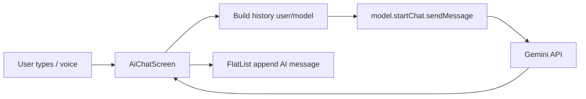

# Hira-AI — Project Summary

**Project root**: `hira-ai-app-capacitor` (this repo).

## Purpose

**Hira-AI** is a monorepo for a comprehensive health-tracking and AI coaching product.

- **Mobile app**: React Native + Expo + Capacitor (TypeScript).
- **Backend**: NestJS (scaffold).
- **Database/Auth**: Supabase (PostgreSQL + Auth).

The project is a design-system–driven mobile application focused on tracking workouts, with an integrated AI wellness coach (Hira) and marketplace. Nutrition, Sleep, and Habits are not in the current app scope (see 4-week plan); related DB tables may exist for future use.

---

## Project State

### Mobile (`apps/mobile`)

**Status**: Active Development  
**Tech Stack**: React Native, Expo (~54), Capacitor (7), TypeScript, TanStack Query, Supabase Client, design tokens (`src/theme.ts`: colors, space, typography, radius), expo-linear-gradient, @react-navigation/drawer, @google/generative-ai, expo-speech-recognition (optional), react-native-safe-area-context.  
**Native builds**: Capacitor config at `apps/mobile/capacitor.config.ts` (appId `com.anonymous.hiraai`, webDir `dist`). Use `npm run cap:sync` then `npm run cap:android` / `npm run cap:ios` for native runs after building.

**Today tab**: The **Today** tab content is the **Workout Tracker** screen (`WorkoutTrackerScreen`) embedded in `TrackHomeScreen` — Move card (program CTA), Muscle intensity, My Workouts, marketplace. **Tabs**: Buy, Today, Hira, Connect, Profile (5 tabs; Workout Insights reachable from Today). The **Hira** tab renders `ChatDrawerScreen` (Drawer navigator with hamburger menu, sidebar "Chat History", header title "Hira", no top-right icons); the main screen inside the drawer is `AiChatScreen`. Back from Program, My Workouts, or Workout Insights returns to the same origin via `programReturnScreen`, `myWorkoutsReturnScreen`, and `workoutInsightsReturnScreen` in `App.tsx` (in-app and hardware back).

**Move card (Workout Tracker)**: When used as the program entry, the card shows **"Create your own program"** with no Start button and no time icon / "High intensity" subtitle (`NextWorkoutCard` props `hideSubtitle`, `hideCta`). Tapping the card navigates to the Program screen.
**Gamification (current state)**: **XP** is disabled in the app (no XP GAINED radial, no rank/XP on profile; hooks and DB tables remain for future use). **Streak** is shown on the tracker home header badge only.

**Implemented Features**:

1. **Authentication**
   - **Auth Flow**: Sign In / Sign Up screens (`AuthScreen`).
   - **Supabase Auth**: Persistent session with AsyncStorage.
   - **Onboarding**: `OnboardingScreen` for new users (name, DOB, gender, height/weight). Step 3 "Your metrics" uses white "metrics" text; height and weight are **text inputs** with unit toggles (cm/in, kg/lbs), committed on blur and on submit; validation and storage in cm/kg. Profile and health context via `ProfileContext`.

2. **Navigation**
   - **Core**: State-based navigation in `App.tsx`.
   - **Main Tabs**: `TrackHomeScreen` with 5 tabs: **Buy** (Shop), **Today** (Workout Tracker), **Hira** (AI Chat), **Connect** (Community), **Profile**. Bottom tab bar uses `BottomTabBar` + `TabItem` with per-tab animation (Reanimated) and white active state. **Hira** tab renders `ChatDrawerScreen` (Drawer with hamburger, sidebar, header "Hira") which contains `AiChatScreen`. **Today** tab renders `WorkoutTrackerScreen` (no back button when embedded); standalone Workout Tracker when `currentScreen === 'workout'`; Workout Insights from Today link.
   - **Return-screen pattern**: Opening **Program**, **My Workouts**, or **Workout Insights** from the Today tab stores return screen `'track'`; opening from the standalone Workout Tracker stores `'workout'`. Back (in-app and Android hardware back) uses the stored value so users return to the correct tab/screen.
   - **Screens**: Workout Tracker (hub), Program, Create Program, Template Create/Session, My Workouts, Workout History, Workout Insights (Muscle intensity), Shop, Cart, Personal Info, Community, Create Post, and others.

3. **AI Chat (Hira)**
   - **Chat tab shell**: The Hira tab renders [ChatDrawerScreen](apps/mobile/src/screens/ChatDrawerScreen.tsx) — a Drawer navigator (header: hamburger left, title "Hira", no top-right icons; sidebar: dark #111, "Chat History" placeholder; one screen "Chat" → AiChatScreen). Wrapped in `EnvironmentContainer` with `solidBackground="#000000"` and tab bar footer.
   - **AiChatScreen**: Minimal chat UI: deep black background, no in-screen header (Drawer provides it). **Model**: [@google/generative-ai](https://www.npmjs.com/package/@google/generative-ai) with **gemini-2.5-flash-lite**; API key from `Constants.expoConfig?.extra?.geminiApiKey` or `process.env.GEMINI_API_KEY`. **Messages**: Plain list `{ id, text, sender: 'user' | 'ai' }`; no system instruction — only conversation history is sent. **Input bar**: Single pill (dark #222) with left "+" (attach placeholder), center `TextInput` ("Type a message..."), right circular gradient button (mic when empty, send arrow when text). **Voice**: Optional [expo-speech-recognition](https://www.npmjs.com/package/expo-speech-recognition) (try/catch require); mic starts/stops listening and fills input with transcript. **Keyboard**: `Keyboard.addListener` (keyboardDidShow/keyboardWillHide); input bar is `position: absolute` with `bottom: keyboardBottomOffset` so it sits above the keyboard (Android: offset reduced by 80px to minimize gap). Disclaimer below input: "Hira AI can make mistakes. Check important info."
   - **Backend / production**: [gemini.service.ts](apps/mobile/src/services/ai/gemini.service.ts) exists for optional streaming/API use; current in-tab chat uses the SDK directly. Production path: `ai-chat.service.ts`, **AI service v2** (`ai-chat-service-v2.ts`); Anthropic/OpenRouter for production API.
   - **Persistence**: Current in-tab chat is in-memory only. Production path can use Supabase (`ai_messages`, `ai_conversations`, `ai_usage_logs`).

4. **Workout Tracking**
   - **Workout Hub**: `WorkoutTrackerScreen` — Move card (program CTA), Muscle intensity, My Workouts, marketplace. Shown as the **Today** tab content (no back button) and as a standalone screen (back to track). Move card taps go to Program; "See all" goes to My Workouts; Muscle intensity goes to Workout Insights; back from each returns to the originating screen/tab.
   - **Program**: `ProgramScreen`, `CreateProgramScreen` — week-by-week schedule, assign templates to days, start program day sessions. **Create Program**: Title, description, periodisation (weeks), and **WEEKLY SCHEDULE** with 7 days (Mon–Sun). User assigns a workout template per day via a "Choose workout" modal (templates from `useWorkoutTemplates`). Selected days show the workout name in a **gradient pill** (same style as ProgramScreen); unselected show "Select workout." Tapping a day **with** a workout expands a **dropdown** listing that template's exercises (single line per exercise: name left, sets/reps right) and a "Change workout" button; tapping a day **without** a workout opens the modal. On Create, `day_assignments` are sent to `useCreateProgram`, which inserts into `workout_program_day_templates` so every week's matching day gets the chosen template.
   - **Template Builder**: `TemplateCreateScreen` for custom workouts.
   - **Session Logger**: `TemplateSessionScreen` for active workout tracking (accepts program id / program day id for completion linking).
   - **Exercise Search**: `ExerciseSearchScreen` with database-driven search.
   - **My Workouts**: `MyWorkoutsScreen`. **Workout Insights**: `WorkoutInsightsScreen` (Muscle intensity). **Activity Analytics**: `ActivityAnalyticsScreen` for steps/distance/pace.

5. **Profile & Health**
   - **Profile**: `ProfileScreen`, `PersonalInfoScreen`; `ProfileContext` for cached profile and health data. Profile screen content is **scrollable** (wrapped in `ScrollView` with bottom padding) so Integrations and Sign out are reachable; screen uses a **solid black background** (`colors.bgMidnight`); the previous purple-to-black gradient was removed. **Sign out**: Profile screen includes a Sign out button at the bottom; calls `supabase.auth.signOut()` (session cleared, app shows auth screens).
   - **Health Data Test**: `HealthDataTestScreen` (e.g. native health module integration).

6. **Marketplace (Shop)**
   - **Browse**: `ShopHomeScreen` — featured supplements, templates, categories.
   - **Cart**: `CartScreen` with `CartContext`, Supabase-backed cart, optimistic updates.

7. **Community Feed**
   - **CommunityScreen**: Feed with tabs **For You**, **Following**, **Trending**; full-width **Create Post** button below tabs; cursor-based pagination via `get_community_feed` RPC.
   - **CreatePostScreen**: New post flow — header (X, "New Post", Post), author + visibility dropdown (**Public** / **Friends**), content input, @ Tag Friends / # Tag Activity pills, AI Content Gen banner, media row (Photo, Video, Poll, Location, More). Submit via `useCreatePost`; visibility and media are UI-only for now.
   - **Post cards**: `CommunityPostCard` — avatar, author, Follow, type tag, body, media, tags, like/comment/share/bookmark. Like and Follow wired to `useLikePost`, `useFollowAuthor`.
   - **Data**: `useCommunityFeed` / `useCommunityFeedFlatItems` (infinite query), `useCommunityActions` (like, follow, comment, create post). Optional `useCommunityPostRealtime()` to invalidate feed on post count changes. Types in `types/community.ts`.

8. **Data & Services**
   - **Supabase**: Direct client usage with RLS.
   - **TanStack Query**: Caching and data fetching (`useWorkoutTemplates`, `useShopProducts`, `useCommunityFeed`, etc.).
   - **Services**: `ai-chat.service.ts`, `ai-context.service.ts`, `HealthService.ts`, `HealthNormalizer.ts`.

### Backend (`apps/backend`)

**Status**: Scaffold / Early Stage  
**Tech Stack**: NestJS 11.  
- Basic structure present. Mobile uses Supabase directly for most operations (offline-first, latency).

---

## Architecture

```mermaid
graph TD
    User((User)) --> MobileApp[Mobile App Expo/RN + Capacitor]

    subgraph MobileApp
        Nav[Navigation Controller]
        Screens[Screens Track Workout Shop Hira Chat]
        Hooks[Custom Hooks + Contexts]
        Query[TanStack Query]
        SupaClient[Supabase Client]
        AIService[ai-chat.service]
        AIContext[ai-context.service]
    end

    MobileApp --> Nav
    Nav --> Screens
    Screens --> Hooks
    Hooks --> Query
    Query --> SupaClient
    Screens --> AIService
    AIService --> AIContext
    AIService --> AIAPI[Anthropic / OpenRouter API]
    Screens --> GenAI[@google/generative-ai]
    GenAI --> GeminiAPI[Gemini API]

    subgraph Backend
        SupabaseDb[(Supabase Postgres)]
        SupabaseAuth[Supabase Auth]
    end

    SupaClient --> SupabaseDb
    SupaClient --> SupabaseAuth
    AIService --> SupabaseDb
```

---

## Code structure and screen architecture

- **Navigation model**: [App.tsx](apps/mobile/src/App.tsx) uses a single `screenStack` state (array of `ScreenKey`). `navigateTo(screen)` pushes a screen; `goBack()` pops. No file-based router; every screen is a conditional render in `App.tsx` (`currentScreen === 'track'` → `TrackHomeScreen`, etc.). Auth uses React Navigation stack (`AuthStack.Navigator`) for SignIn/SignUp; after login, the rest is state-driven.
- **Auth and onboarding gate**: `AuthenticatedLayout` wraps authenticated content: if `profile?.full_name` is missing, it renders `OnboardingScreen` until complete; otherwise it renders `children` (the main screen tree).
- **Screen composition pattern**: Most authenticated screens follow:
  - **Root**: `EnvironmentContainer` ([EnvironmentContainer.tsx](apps/mobile/src/components/EnvironmentContainer.tsx)) — full-height layout, optional `ScrollView`, padding (`space.md` horizontal, 110px bottom for tab bar), optional fixed `footer`.
  - **Header**: `ScreenHeader` ([ScreenHeader.tsx](apps/mobile/src/components/ScreenHeader.tsx)) — left slot (e.g. back button), optional `rightBadges`, optional cart button. Uses `colors`, `space`, `typography` from theme; respects `StatusBar.currentHeight` on Android.
  - **Content**: One or more `Section` wrappers ([Section.tsx](apps/mobile/src/components/Section.tsx)) — spacing between blocks (`xs` | `sm` | `md` | `lg` mapped to [theme.ts](apps/mobile/src/theme.ts) `space`).
  - **Design tokens**: All from [theme.ts](apps/mobile/src/theme.ts): `colors` (e.g. `bgMidnight`, `primaryViolet`, `textPrimary`), `space`, `radius`, `typography`. Components import theme and use these tokens instead of hardcoded values.
- **Tab shell**: The main app shell is `TrackHomeScreen`, which holds tab state and renders one of: `ShopHomeScreen`, `WorkoutTrackerScreen` (Today), `AiChatScreen`, `CommunityScreen`, or `ProfileScreen`. Tabs use [BottomTabBar](apps/mobile/src/components/BottomTabBar.tsx) + [TabItem](apps/mobile/src/components/TabItem.tsx) (Reanimated for active state). Tab config is `TRACK_TABS` in [TrackHomeScreen.tsx](apps/mobile/src/screens/TrackHomeScreen.tsx) (icons: MaterialCommunityIcons name or custom `iconImage` require).
- **Screen–data flow**: Screens receive navigation callbacks as props (e.g. `onNavigateToProgram`, `goBack`). Data comes from hooks (e.g. `useWorkoutTemplates`, `useProfile`) and contexts (`ProfileContext`, `CartContext`). TanStack Query for server state, React Context for global client state; no Redux.

**Screen reference**

| ScreenKey | Component | Layout | Primary data |
|-----------|-----------|--------|--------------|
| (auth) | SignInScreen, SignUpScreen | Auth stack (React Navigation) | Supabase auth |
| track | TrackHomeScreen | Tab shell + content switcher | tab state, nav callbacks |
| workout | WorkoutTrackerScreen | Custom (View + ScrollView) | useProgramSchedule, useWorkoutTemplates, useUserStreaks |
| profile | ProfileScreen | EnvironmentContainer + ScreenHeader + Section | ProfileContext |
| shop (tab) | ShopHomeScreen | EnvironmentContainer + ScreenHeader | useShopProducts, CartContext |
| chat (tab) | ChatDrawerScreen → AiChatScreen | EnvironmentContainer + Drawer (hamburger, sidebar) + SafeAreaView, FlatList, absolute input bar | @google/generative-ai (gemini-2.5-flash-lite), GEMINI_API_KEY; optional expo-speech-recognition. See "AI Chat (Hira) – End-to-End" |
| community (tab) | CommunityScreen | EnvironmentContainer + Section | useCommunityFeed, useCommunityActions |
| program | ProgramScreen | EnvironmentContainer + ScreenHeader + Section | useProgramSchedule |
| program-create | CreateProgramScreen | EnvironmentContainer + Section | useCreateProgram, useWorkoutTemplates |
| template-create | TemplateCreateScreen | EnvironmentContainer + Section | useWorkoutTemplates, template state |
| template-session | TemplateSessionScreen | Custom layout | session state, Supabase sessions |
| my-workouts | MyWorkoutsScreen | EnvironmentContainer + ScreenHeader + Section | useWorkoutTemplates |
| workout-history | WorkoutHistoryScreen | EnvironmentContainer + Section | workout history hooks |
| workout-insights | WorkoutInsightsScreen | EnvironmentContainer + Section | useTodayWorkoutForIntensity, muscle mappings |
| cart | CartScreen | EnvironmentContainer + ScreenHeader | CartContext |
| create-post | CreatePostScreen | EnvironmentContainer + ScreenHeader | useCreatePost, ProfileContext |
| personal-info | PersonalInfoScreen | EnvironmentContainer + Section | ProfileContext |
| onboarding | OnboardingScreen | Custom (steps) | ProfileContext, Supabase profiles |
| activity-analytics | ActivityAnalyticsScreen | EnvironmentContainer + Section | analytics hooks |
| exercises, exercise-detail, workout-session-detail, activity-type-workouts, add-exercises-for-session | ExercisesScreen, ExerciseDetailScreen, etc. | EnvironmentContainer + Section or custom | useExercises, useWorkoutSessionDetail, etc. |
| preferences, integrations, help-support, achievements | PreferencesScreen, IntegrationsScreen, etc. | EnvironmentContainer + Section | ProfileContext / settings |

---

## AI Chat (Hira) – End-to-End

This section describes the in-app AI chat: where it lives, how the screen is built, and how the Gemini pipeline works.

### Where It Lives in the App

- **Tab**: The **Hira** tab in the main bottom navigation ([TrackHomeScreen](apps/mobile/src/screens/TrackHomeScreen.tsx)) renders [ChatDrawerScreen](apps/mobile/src/screens/ChatDrawerScreen.tsx), not AiChatScreen directly.
- **Shell**: `TrackHomeScreen` wraps content in [EnvironmentContainer](apps/mobile/src/components/EnvironmentContainer.tsx) with `solidBackground="#000000"` for the chat tab; footer is the bottom tab bar. Inside that, ChatDrawerScreen provides a Drawer navigator (independent `NavigationContainer`).
- **Drawer**: Header (hamburger left, title "Hira", `headerRight: () => null`), custom sidebar (dark #111, "Chat History"), one screen "Chat" → [AiChatScreen](apps/mobile/src/screens/AiChatScreen.tsx).

### AiChatScreen – Build and Behavior

**File**: [apps/mobile/src/screens/AiChatScreen.tsx](apps/mobile/src/screens/AiChatScreen.tsx)

**Layout (top to bottom)**:

1. **Root**: `SafeAreaView` (from `react-native-safe-area-context`), flex 1, background `#000`.
2. **FlatList**: Messages; `contentContainerStyle` includes dynamic `paddingBottom: listBottomPadding` (when keyboard open: `keyboardBottomOffset + inputAreaHeight`; when closed: 120). Each item is a simple `View` (user: right, #007AFF; ai: left, #222).
3. **Loading**: Optional `ActivityIndicator` below the list when waiting for API.
4. **Input area** (absolute, left 0, right 0): `bottom: keyboardBottomOffset` when keyboard open, else 0. Contains:
   - **Input bar**: Pill (#222) with left "+" (attach placeholder), center `TextInput` ("Type a message...", multiline), right circular gradient button (mic icon when input empty, send icon when text present). Mic triggers optional voice input (expo-speech-recognition); send submits the message.
   - **Disclaimer**: "Hira AI can make mistakes. Check important info." (grey, below bar).

**State**:

- `messages`: `{ id, text, sender: 'user' | 'ai' }[]`.
- `inputText`, `loading`, `apiKeyError`, `model` (GenerativeModel), `isListening` (voice), `keyboardBottomOffset`.
- Refs: `flatListRef` for scroll-to-end.

**Keyboard**:

- `Keyboard.addListener('keyboardDidShow'/'keyboardWillShow')`: Compute offset from `Dimensions.get('window').height - e.endCoordinates.screenY` (fallback: `e.endCoordinates.height`). On Android, subtract 80 to reduce gap above keyboard. Set `keyboardBottomOffset`.
- `keyboardDidHide`/`keyboardWillHide`: Set `keyboardBottomOffset` to 0.
- Input wrapper uses `position: absolute` and `bottom: keyboardBottomOffset` so the bar sits above the keyboard.

**Send flow**:

1. User taps send (or voice fills input and user taps send). `sendMessage` runs.
2. Append user message to `messages`; clear input; set loading.
3. Build `history` from `messages` as `{ role: 'user'|'model', parts: [{ text }] }[]`.
4. `model.startChat({ history }).sendMessage(userMessage.text)`; get `response.text()`, append AI message. On error, `Alert.alert`. No system instruction; only conversation is sent.

**API key**: `Constants.expoConfig?.extra?.geminiApiKey ?? process.env.GEMINI_API_KEY` (set via app.config.js from `GEMINI_API_KEY` in .env).

**Voice**: Optional `expo-speech-recognition` (require in try/catch). If available, mic button starts/stops recognition; transcript written to `inputText` via `useEffect` + `addListener('result')`.

### Gemini Integration (current chat)

- **SDK**: [@google/generative-ai](https://www.npmjs.com/package/@google/generative-ai) — `GoogleGenerativeAI`, `getGenerativeModel({ model: 'gemini-2.5-flash-lite' })`, `startChat({ history })`, `sendMessage(text)`.
- **No system instruction**: Only the conversation (user/model messages) is sent; no separate system prompt or context builder in this flow.
- **Optional**: [gemini.service.ts](apps/mobile/src/services/ai/gemini.service.ts) exists for streaming/other use; production AI services (v2, Anthropic/OpenRouter) remain available for future use.

### Data Flow (AI Chat tab)



### File Reference (AI Chat)

| Purpose | File |
|--------|------|
| Drawer shell (Hira tab) | [ChatDrawerScreen.tsx](apps/mobile/src/screens/ChatDrawerScreen.tsx) |
| Chat UI | [AiChatScreen.tsx](apps/mobile/src/screens/AiChatScreen.tsx) |
| Tab shell | [TrackHomeScreen.tsx](apps/mobile/src/screens/TrackHomeScreen.tsx) |
| Container (solidBackground) | [EnvironmentContainer.tsx](apps/mobile/src/components/EnvironmentContainer.tsx) |
| Optional Gemini service | [gemini.service.ts](apps/mobile/src/services/ai/gemini.service.ts) |
| Context building (other flows) | [context-builder.service.ts](apps/mobile/src/services/ai/context-builder.service.ts), [context-formatter.service.ts](apps/mobile/src/services/ai/context-formatter.service.ts) |

---

## Assets and images

- **Local asset location**: Static images live under **`apps/mobile/assets/`**. In config, paths are relative to the app root (e.g. `./assets/hira-logo.png`); in code, from `src/` use `require('../../assets/...')`.
- **app.json / Expo config**: [app.json](apps/mobile/app.json) references: **icon** and **splash.image** `./assets/hira-logo.png`; **android.adaptiveIcon.foregroundImage** `./assets/icon-adaptive-foreground.png`; **web.favicon** `./assets/hira-logo.png`. These drive app icon, splash, and web favicon; they are not imported in screen code.
- **In-code local images**: Used via `require('../../assets/<file>')` from files under `src/`. Examples:
  - [WorkoutTrackerScreen.tsx](apps/mobile/src/screens/WorkoutTrackerScreen.tsx): `ACTIVITY_TYPES` — `bodybuilding.jpg`, `calisthenics-woman.png`, `male-runner-in-action.jpg`, `stretch.jpg`, `yoga-female.png` for activity cards (`ImageBackground` / `Image` `source={item.source}`).
  - [TrackHomeScreen.tsx](apps/mobile/src/screens/TrackHomeScreen.tsx): Hira tab `iconImage: require('../../assets/hira-icon.png')` in tab config; rendered by `TabItem`.
  - [OverviewCards.tsx](apps/mobile/src/components/OverviewCards.tsx): Next workout card background — `require('../../assets/rest-day.png')` or `require('../../assets/man-working-out.png')` by state.
  - [WelcomeSplashScreen.tsx](apps/mobile/src/screens/WelcomeSplashScreen.tsx): `source={require('../../assets/hira-logo.png')}` for splash logo.
- **Remote images (URLs)**: Rendered with `<Image source={{ uri: someUrl }} />`. Used for: user avatars ([CreatePostScreen](apps/mobile/src/screens/CreatePostScreen.tsx) `profile.avatar_url`, [CommunityPostCard](apps/mobile/src/components/CommunityPostCard.tsx) `item.author_avatar_url`), shop product images ([ShopHomeScreen](apps/mobile/src/screens/ShopHomeScreen.tsx), [CartScreen](apps/mobile/src/screens/CartScreen.tsx) variant/product images), and community post media. URLs come from Supabase storage or API responses.
- **Summary**: Local assets are bundled via `require()` from `apps/mobile/assets`; app-level assets are configured in `app.json`; user- and content-generated images use `source={{ uri }}` from API/Supabase.

---

## Run from project root

All commands are from repo root `hira-ai-app-capacitor` unless noted.

| Goal | Command |
|------|--------|
| Install mobile deps | `cd apps/mobile && npm install` |
| Start Expo dev server | `cd apps/mobile && npm start` (Metro at http://localhost:8081) |
| Web | From Expo terminal press `w`, or `cd apps/mobile && npm run web` |
| Android | `cd apps/mobile && npm run android` |
| iOS | `cd apps/mobile && npm run ios` |
| Capacitor sync | `cd apps/mobile && npm run cap:sync` |
| Capacitor Android/iOS | `cd apps/mobile && npm run cap:android` / `cap:ios` |
| Backend dev | `cd apps/backend && npm install && npm run start:dev` |
| PWA deploy | `cd apps/mobile && npm run build:web` → deploy **dist/** to Vercel (root `apps/mobile`). See SETUP.md. |

See **SETUP.md** for prerequisites (Node, Android Studio, Xcode, env vars) and **Deploy as PWA (Vercel)**.

---

## Folder structure (key paths, relative to project root)

```
hira-ai-app-capacitor/
  apps/
    mobile/
      app.json                 # Expo config (web.output: single, experiments.tsconfigPaths)
      capacitor.config.ts      # Capacitor appId, webDir
      package.json             # start, android, ios, web, cap:sync, cap:ios, cap:android
      tsconfig.json            # baseUrl, paths "@/*": ["./src/*"]
      src/
        features/              # Feature re-exports: ai/, shop/, community/, workout/
        components/            # OverviewCards, ScreenHeader, ActionCard, BottomTabBar,
                               # TabItem, CardGrid, EnvironmentContainer, PrimaryButton,
                               # Section, CommunityPostCard, MetricCard, RadialMetric, ...
        context/               # CartContext, ProfileContext
        hooks/                 # useShopProducts, useWorkoutTemplates,
                               # useExerciseSearch,
                               # useUserStreaks, useUserXp (unused in UI), useCommunityFeed,
                               # useCommunityActions, useTodayWorkoutStats, ...
        lib/                   # supabase.ts, react-query.ts
        screens/               # AuthScreen, OnboardingScreen, TrackHomeScreen, ChatDrawerScreen,
                               # AiChatScreen, WorkoutTrackerScreen, TemplateCreateScreen,
                               # TemplateSessionScreen, MyWorkoutsScreen, ExerciseSearchScreen,
                               # ProgramScreen, CreateProgramScreen, ActivityAnalyticsScreen,
                               # WorkoutInsightsScreen, WorkoutHistoryScreen, WorkoutSessionDetailScreen,
                               # ShopHomeScreen, CartScreen, ProfileScreen, PersonalInfoScreen,
                               # CommunityScreen, CreatePostScreen, ActivityTypeWorkoutsScreen,
                               # ExercisesScreen, ...
        services/              # ai-chat.service.ts, ai-context.service.ts, ai/gemini.service.ts,
                               # ai/context-builder.service.ts, ai/context-formatter.service.ts,
                               # HealthService.ts, HealthNormalizer.ts, ...
        theme.ts
        App.tsx
    backend/                   # NestJS 11 scaffold
      package.json
  docs/                        # ai-chat-local-e2e, template-editing-feature, workout-tracker, ...
  supabase/
    migrations/                # SQL migrations (e.g. ai_usage_logs, community, RLS, ...)
  DESIGN-SYSTEM.md
  SETUP.md
  TROUBLESHOOTING.md
  database-schema.md
  PROJECT_SUMMARY.md           # this file
```

---

## Database Implementation (Supabase)

**Primary Tables**:
- `auth.users`: Supabase Auth.
- **AI**: `ai_conversations`, `ai_messages`, `ai_memory_snapshots` (for Hira chat and context).
- **Shop**: `shop_products`, `shop_variants`, `shop_categories`, `shop_cart_items`.
- **Workouts**: `workout_programs`, `workout_program_days`, `workout_program_day_templates`, `workout_templates`, `workout_template_exercises`, `workout_template_sets`, `workout_sessions`, `workout_session_exercises`, `workout_session_sets`, `workout_program_completions`, `workout_program_adaptations`, `exercises`. Row Level Security (RLS) for per-user isolation of program/template/session data is applied via migrations under **`supabase/migrations/`** (project root).
- **Profile**: `profiles`, `user_health_profile`, `body_weight_logs`.
- **Optional / future**: `daily_feelings` (migration in `supabase/migrations/20250218000000_daily_feelings.sql`). Nutrition and habit tables may exist in DB but are not used by the current app.
- **Community**: `community_posts`, `community_feed_items`, `community_follows`, `community_blocks`, `community_post_likes`, `community_comments`, `community_feed_events`, `community_reports`, `community_user_interests`, `community_moderation_actions`; RLS and triggers for counts; `get_community_feed` RPC for cursor-paginated feed (for_you / following / trending).
- **Gamification**: `user_xp`, `user_streaks`, leaderboards (migrations in **`supabase/migrations/`**). XP is not currently used in the mobile UI; streak is shown on the tracker home header only.

---

## Recent Updates & Next Steps

**Recent Achievements**:
- **Mobile run & build**: Expo `app.json` uses `web.output: "single"` so `npm start` works without expo-router. **Capacitor** added for native builds (`capacitor.config.ts`, `cap:sync`, `cap:android`, `cap:ios`); webDir is `dist`.
- **PWA deploy**: Web build via `npm run build:web` → **dist/**; deploy to Vercel with root `apps/mobile` and `vercel.json` (SPA rewrites). Users install via Safari → Add to Home Screen. Optional `public/manifest.json` for standalone display and theme.
- **Tracker home layout & UX**:
  - **Bottom nav**: Tab labels **Buy**, **Today**, **Hira**, **Connect**, **Profile**. Animated tab bar (Reanimated: icon jump, label/dot) with white active state. No cart icon on Today tab; streak badge only in header.
  - **XP removed from UI**: No XP radial or rank on profile/shop; streak kept on tracker home.
  - **Profile**: Sign out button at bottom of Profile screen; calls `supabase.auth.signOut()`.
- **Community Feed & Create Post**:
  - **CommunityScreen**: Tabs (For You, Following, Trending), full-width Create Post button below tabs, FlatList with `CommunityPostCard`, cursor pagination, pull-to-refresh, empty/error states. Like and Follow actions wired; optional Realtime invalidation for post counts.
  - **CreatePostScreen**: New post flow with header (X, "New Post", Post), author row + visibility dropdown (Public / Friends) positioned near the button, content input, tag pills, AI Content Gen banner, media options. Submits text posts via `useCreatePost`; feed invalidated on success.
  - **Backend**: Migrations for community tables + RLS (`20250208100000_community_tables.sql`, `20250208100001_community_rls.sql`), triggers for `total_likes` / `total_comments` (`20250208100003_community_triggers.sql`), `get_community_feed` RPC with blocked/approved filtering and cursor pagination (`20250208100002_community_feed_rpc.sql`).
- **Workout Insights (Muscle Intensity)**:
  - New `WorkoutInsightsScreen` showing **per-muscle intensity** for the day’s workouts using `MuscleIntensityCalculator`.
  - Data pipeline: `exercise_muscle_mapping` table, `useExerciseMuscleMappings`, `useTodayWorkoutForIntensity`, and `ProfileContext` (activity level → fitness level).
  - Template/session detail: `WorkoutSessionDetailScreen` now includes a **Muscle intensity** section computed from that specific session’s exercises/sets, respecting the originating template.
- **Today tab = Workout Tracker**:
  - **Today** tab content is `WorkoutTrackerScreen` (Move card, Muscle intensity, My Workouts, marketplace).
  - **Return-screen state**: `programReturnScreen`, `myWorkoutsReturnScreen`, `workoutInsightsReturnScreen` — back from Program, My Workouts, or Workout Insights returns to Today tab when opened from Today, or to standalone Workout Tracker when opened from there (in-app and Android hardware back).
  - **Move card (program CTA)**: "Create your own program" label; `hideSubtitle` and `hideCta` on `NextWorkoutCard` remove time icon, "High intensity" text, and Start button; tap navigates to Program.
- **Onboarding**: Step 3 metrics — "metrics" text is white; height and weight are text inputs (no sliders), with cm/in and kg/lbs toggles; values committed on blur and submit, stored in cm/kg.
- **Workout RLS**: Migration enables RLS on `workout_programs`, `workout_program_days`, `workout_program_day_templates`, `workout_program_adaptations`, `workout_program_completions`, `workout_templates`, `workout_template_exercises`, `workout_template_sets`, `workout_sessions`, `workout_session_exercises`, `workout_session_sets` so each user can only access their own data.
- **Workout UX**: `MyWorkoutsScreen` header action **History**; `NextWorkoutCard` supports optional `hideSubtitle` and `hideCta` for simplified program CTA.
- **Database**: Workout and community migrations in sync with schema; optional `daily_feelings` migration available (`20250218000000_daily_feelings.sql`).
- **Create Program – Weekly schedule and day templates**:
  - Below periodisation: WEEKLY SCHEDULE with 7 day rows. Per day: select a workout from templates (modal) or leave unset. Selected workouts shown in a gradient pill; unset days show "Select workout." Tapping a day with a workout expands a dropdown with that workout's exercises (name left, sets/reps right, single line) and "Change workout"; tapping a day without a workout opens the Choose workout modal.
  - Data: `CreateProgramInput.day_assignments` (day_number 1–7 → template id); `useCreateProgram` inserts `workout_program_days` then `workout_program_day_templates` so all weeks get the same pattern.
- **Profile screen**:
  - Content wrapped in `ScrollView` (flex: 1, contentContainerStyle paddingTop/paddingBottom) so the full profile (including Integrations, Sign out) scrolls. Root background set to solid black (`colors.bgMidnight`); `LinearGradient` background removed.

**4-week restructuring completed**: AI chat v2 (usage limits, suggestions, history), `features/` re-exports (ai, shop, community, workout), path alias `@/*`, 5-tab nav (Profile replaces Progress), CHANGELOG and PROJECT_SUMMARY updated. Optional: React.memo on list items, device testing, EAS/TestFlight build.

**AI Chat (Hira)**: Hira tab renders **ChatDrawerScreen** (Drawer: hamburger, sidebar "Chat History", header "Hira", no top-right icons). **AiChatScreen** uses **@google/generative-ai** with **gemini-2.5-flash-lite**; API key from app config (`GEMINI_API_KEY`). No system instruction — only conversation history is sent. Minimal UI: FlatList messages, absolute input bar (pill with +, TextInput, mic/send gradient button), disclaimer. Optional **expo-speech-recognition** for voice input (try/catch require). Keyboard: `Keyboard.addListener` + `keyboardBottomOffset` so input bar sits above keyboard (Android offset −80 to reduce gap). SafeAreaView from `react-native-safe-area-context`.

**Upcoming Priorities**:
1. **Checkout Flow**: Complete Shop payment integration.
2. **Offline Mode**: Harden offline behavior in services and sync.
3. **AI**: Voice (expo-speech-recognition) is optional in Hira; attach/+ button is placeholder. Optional cache for duplicate prompts; production API integration (v2, usage limits) for future.

