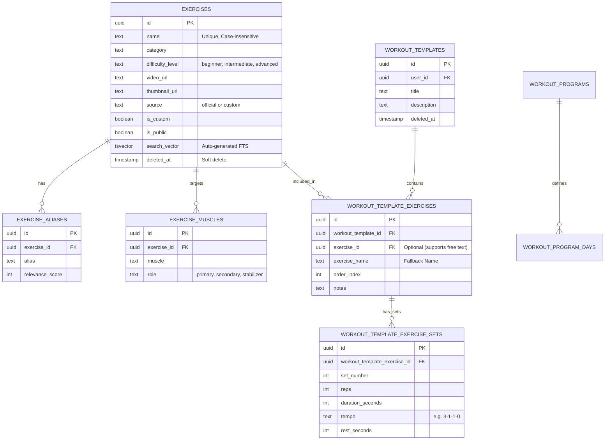
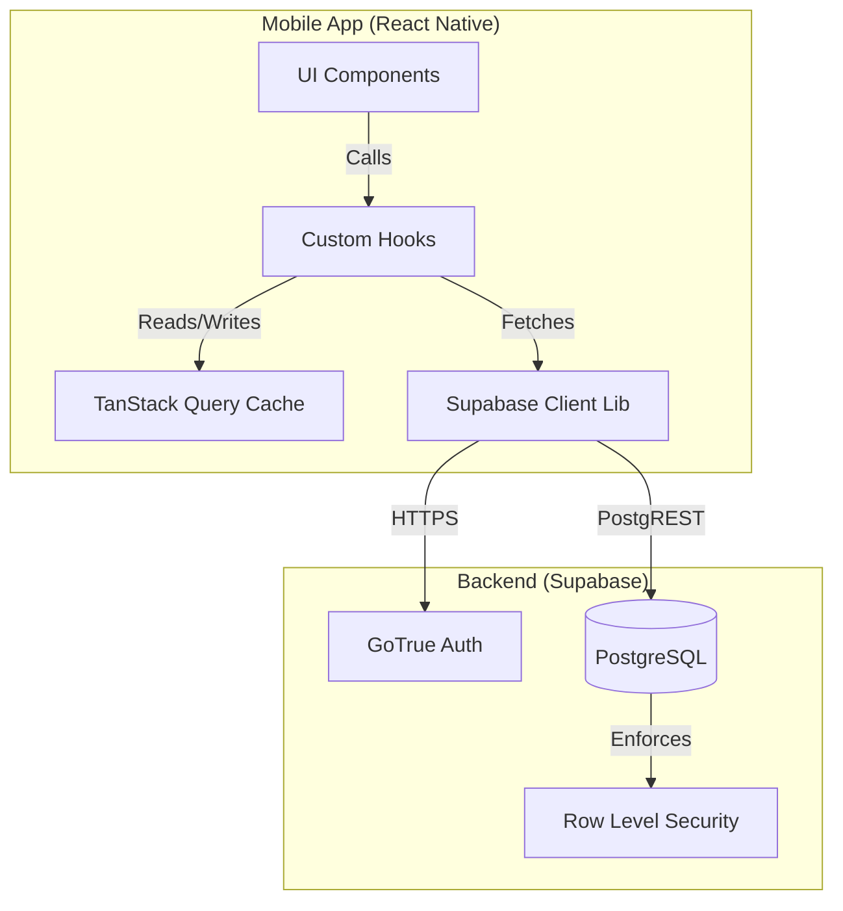
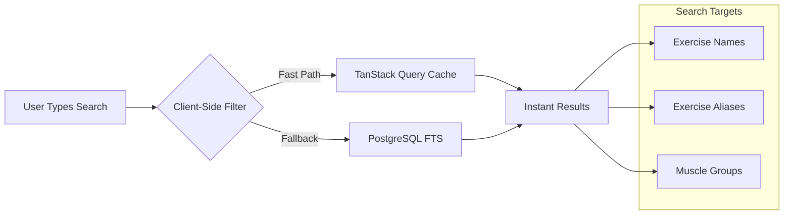

# Workout Tracker Documentation

## Overview

The **Workout Tracker** is a core module of the Hira AI application designed to help users create, manage, and track their fitness routines. It allows users to define custom workout templates, log active sessions, and analyze their progress over time.

### Key Features
- **Exercise Library**: A comprehensive database of 112 seeded exercises with 181 aliases and 230 muscle mappings across 21 muscle groups.
- **Workout Templates**: Users can build reusable workout plans (templates) consisting of multiple exercises and sets.
- **Session Tracking**: Execute workout templates and log real-time data (reps, weight, RPE).
- **Offline-First**: Leveraging local caching for seamless access to templates and exercises.
- **Smart Search**: Hybrid client-side and server-side search with alias matching and muscle targeting.

---

## Database Schema

The data model is built on **Supabase (PostgreSQL)**, structured to support flexibility in exercise definition and rigid structure for performance tracking.

### Entity Relationship Diagram



### Table Definitions

#### 1. Exercises Core
*   **`exercises`**: The master list of exercises.
    *   `id`: UUID (PK)
    *   `name`: Text (Unique, Case-Insensitive via index)
    *   `category`: Text (strength, cardio, mobility)
    *   `difficulty_level`: Text ('beginner', 'intermediate', 'advanced')
    *   `equipment`: Text (barbell, dumbbell, bodyweight, cable, machine, band, kettlebell, medicine ball, other)
    *   `video_url`: Text (Tutorial video link)
    *   `thumbnail_url`: Text (Preview image)
    *   `source`: Text ('official' or 'custom')
    *   `search_vector`: TSVector (Auto-generated for Full-Text Search from name)
    *   `is_public`: Boolean (Global exercises visible to all)
    *   `is_custom`: Boolean (User-created vs system exercises)
    *   `deleted_at`: Timestamptz (Soft delete)
    *   **Current Data**: 112 seeded exercises (88 strength, 10 cardio, 8 mobility, 6 olympic/functional)

*   **`exercise_aliases`**: Alternative names for exercises (e.g., "Bench Press" -> "Flat Bench", "RDL" -> "Romanian Deadlift").
    *   `exercise_id`: FK to `exercises` (CASCADE on delete)
    *   `alias`: Text (Alternative name)
    *   `relevance_score`: Int (For search ranking, 8-10 for seeded data)
    *   **Unique Constraint**: (exercise_id, alias)
    *   **FTS Index**: GIN index on `to_tsvector('english', alias)`
    *   **Current Data**: 181 aliases across all exercises

*   **`exercise_muscles`**: Anatomy mapping.
    *   `exercise_id`: FK to `exercises` (CASCADE on delete)
    *   `muscle`: Text (e.g., "Pectoralis Major", "Quadriceps", "Latissimus Dorsi")
    *   `role`: Text ('primary', 'secondary', 'stabilizer')
    *   **Current Data**: 230 muscle mappings across 21 unique muscle groups
    *   **Muscle Groups**: Pectoralis Major, Triceps Brachii, Deltoid (Anterior/Lateral/Posterior), Latissimus Dorsi, Rhomboids, Trapezius, Biceps Brachii, Brachioradialis, Erector Spinae, Quadriceps, Hamstrings, Gluteus Maximus/Medius, Gastrocnemius, Soleus, Hip Flexors, Rectus Abdominis, Obliques, Transverse Abdominis

#### 2. Templates
*   **`workout_templates`**: User-defined workout plans.
    *   `user_id`: UUID (Owner)
    *   `title`: Text
    *   `description`: Text
    *   `estimated_duration_minutes`: Int
    *   `deleted_at`: Timestamptz (Soft delete)

*   **`workout_template_exercises`**: Join table linking templates to exercises.
    *   `workout_template_id`: FK to `workout_templates`
    *   `exercise_id`: FK to `exercises` (Nullable: Allows custom exercises not in DB)
    *   `exercise_name`: Text (Preserved even if exercise is deleted)
    *   `order_index`: Int (Sequence in workout)
    *   **Unique Constraint**: (workout_template_id, order_index)

*   **`workout_template_sets`**: Prescribed sets for a template.
    *   `workout_template_exercise_id`: FK to `workout_template_exercises`
    *   `set_number`: Int
    *   `reps`: Int (Target repetitions)
    *   `duration_seconds`: Int (For timed exercises)
    *   `tempo`: Text (e.g., "3-1-1-0" for eccentric-pause-concentric-pause)
    *   `rest_seconds`: Int (Rest period after this set)

---

## Services & Application Logic

The application follows a **Client-First** architecture using React Native, utilizing Supabase as a "Backend-as-a-Service" and TanStack Query for state management.

### Architecture Overview



### Key Services

#### 1. Data Fetching & Caching (`useWorkoutTemplates`)
We use a custom hook to manage workout template data. This ensures:
*   **Zero Loading States on Navigation**: Data is served instantly from the cache.
*   **Background Refetching**: Data is kept fresh without blocking user interaction.
*   **Stale-While-Revalidate**: Users see cached data while an update happens in the background.

**Logic Flow:**
```typescript
// Simplified Logic Representation
function useWorkoutTemplates() {
  return useQuery({
    queryKey: ['workoutTemplates'],
    queryFn: async () => {
      // 1. Fetch from Supabase
      const { data } = await supabase
        .from('workout_templates')
        .select('*, workout_template_exercises(count)')
        .order('updated_at', { ascending: false });
      
      // 2. Return Data (Automatically cached by React Query)
      return data;
    },
    staleTime: 5 * 60 * 1000, // 5 minutes
  });
}
```

#### 2. Template Editing & Management
We support full Create, Read, Update, Delete (CRUD) operations for templates with optimistic updates and seamless UI states.

**Key Features:**
*   **Edit Mode**: Re-uses `TemplateCreateScreen` to edit existing templates.
*   **Deep Fetching**: `useWorkoutTemplate(id)` fetches the template *plus* all exercises and sets.
*   **Atomic Updates**:
    *   Updating a template is handled as a transaction:
        1.  Update local template fields (title, description).
        2.  Delete *all* old exercises/sets for this template.
        3.  Re-insert *all* new exercises/sets.
    *   This ensures no "orphaned" sets or complex diffing logic is needed on the client.
*   **Deletion**: Supported with confirmation dialogs.

**Hooks:**
```typescript
// Fetch single template with deep relations
const { data } = useWorkoutTemplate(templateId);

// Update existing template
const updateMutation = useUpdateWorkoutTemplate();
updateMutation.mutate({ templateId, title, exercises });

// Delete template
const deleteMutation = useDeleteWorkoutTemplate();
deleteMutation.mutate(templateId);
```

#### 3. Exercise Search System

The exercise search system uses a **hybrid approach** combining client-side filtering for instant results and server-side Full-Text Search (FTS) for advanced queries.

##### Search Architecture



##### Client-Side Search (Primary)
- **Hook**: `useExerciseSearch(searchTerm)`
- **Strategy**: In-memory filtering of cached exercises
- **Performance**: Instant (< 1ms)
- **Cache Duration**: 30 minutes
- **Matches Against**:
  - Exercise name (case-insensitive substring)
  - Category
  - Primary muscle groups

**Implementation:**
```typescript
// apps/mobile/src/hooks/useExerciseSearch.ts
export function useExerciseSearch(searchTerm: string) {
  const { data: allExercises } = useExercises(); // Cached exercises
  
  const filtered = useMemo(() => {
    if (!searchTerm) return allExercises;
    
    const term = searchTerm.toLowerCase();
    return allExercises.filter(ex => 
      ex.name.toLowerCase().includes(term) ||
      ex.category?.toLowerCase().includes(term) ||
      ex.exercise_muscles?.some(m => m.muscle.toLowerCase().includes(term))
    );
  }, [allExercises, searchTerm]);
  
  return { exercises: filtered };
}
```

##### Server-Side FTS (Advanced)
- **Function**: `search_exercises(search_term)`
- **Strategy**: PostgreSQL Full-Text Search with ranking
- **Performance**: ~5-20ms (indexed)
- **Features**:
  - Stemming (finds "running" when searching "run")
  - Alias matching (finds "Bench Press" via "Flat Bench")
  - Relevance ranking
  - Muscle group aggregation

**Database Function:**
```sql
CREATE FUNCTION search_exercises(search_term text)
RETURNS TABLE (
  id uuid,
  name text,
  category text,
  difficulty_level text,
  thumbnail_url text,
  muscles text[],
  rank real
) AS $$
BEGIN
  RETURN QUERY
  SELECT DISTINCT ON (e.id)
    e.id, e.name, e.category, e.difficulty_level, e.thumbnail_url,
    ARRAY_AGG(DISTINCT em.muscle) FILTER (WHERE em.role = 'primary') as muscles,
    GREATEST(
      ts_rank(e.search_vector, plainto_tsquery('english', search_term)),
      COALESCE(ts_rank(to_tsvector('english', ea.alias), plainto_tsquery('english', search_term)), 0)
    ) as rank
  FROM exercises e
  LEFT JOIN exercise_aliases ea ON ea.exercise_id = e.id
  LEFT JOIN exercise_muscles em ON em.exercise_id = e.id
  WHERE 
    e.deleted_at IS NULL
    AND (
      e.search_vector @@ plainto_tsquery('english', search_term)
      OR to_tsvector('english', ea.alias) @@ plainto_tsquery('english', search_term)
    )
  GROUP BY e.id, e.name, e.category, e.difficulty_level, e.thumbnail_url, e.search_vector, ea.alias
  ORDER BY e.id, rank DESC
  LIMIT 20;
END;
$$ LANGUAGE plpgsql;
```

##### Search Indexes
1. **`exercises_search_idx`**: GIN index on `exercises.search_vector`
2. **`idx_exercise_aliases_search`**: GIN index on `to_tsvector('english', exercise_aliases.alias)`
3. **`idx_exercises_name_unique`**: Unique index on `LOWER(name)` (with soft delete filter)

#### 3. Authentication & Security
*   **Service**: `supabase.auth` (in `lib/supabase.ts`)
*   **Persistence**: `AsyncStorage` maintains the session token on the device.
*   **RLS Policies**: Database policies ensure users can only see:
    *   Their own private templates (`user_id = auth.uid()`).
    *   Global public exercises (`is_public = true`).

---

## Exercise Database Seeding

### Data Source

The exercise database was seeded from **`docs/clean_exercises_json.json`**, a curated JSON file containing 100 exercises with comprehensive metadata. This file was provided by Claude AI and includes:

- Exercise names and categories
- Difficulty levels (beginner, intermediate, advanced)
- Equipment requirements
- Alternative names (aliases) for better searchability
- Muscle group targeting with roles (primary, secondary, stabilizer)

**File Location**: `C:\Users\saisa\hira-ai\docs\clean_exercises_json.json`

### Seeding Statistics

| Metric | Count |
|--------|-------|
| Total Exercises | 112 |
| Exercise Aliases | 181 |
| Muscle Mappings | 230 |
| Unique Muscles | 21 |

### Exercise Breakdown by Category

#### Strength Exercises (~88)
- **Chest**: 14 exercises (Barbell Bench Press, Dumbbell Bench Press, Push-Ups, Flyes, etc.)
- **Back**: 15 exercises (Deadlifts, Rows, Pull-Ups, Lat Pulldowns, etc.)
- **Shoulders**: 12 exercises (Overhead Press, Lateral Raises, Face Pulls, etc.)
- **Arms**: 11 exercises (Bicep Curls, Tricep Extensions, Dips, etc.)
- **Legs**: 20 exercises (Squats, Lunges, Leg Press, Calf Raises, etc.)
- **Core**: 12 exercises (Planks, Crunches, Russian Twists, etc.)

#### Cardio Exercises (10)
- Running, Cycling, Rowing, Elliptical, Jump Rope, Stair Climber, High Knees, Burpees, Mountain Climbers, Assault Bike

#### Mobility Exercises (8)
- World's Greatest Stretch, Hip Flexor Stretch, 90-90 Hip Rotation, Thoracic Spine Rotation, Cat-Cow Stretch, Ankle Dorsiflexion Drill, Shoulder Dislocates, Deep Squat Hold

#### Olympic/Functional Exercises (10)
- Power Clean, Clean and Jerk, Snatch, Thruster, Kettlebell Swing, Man Maker, Farmer's Carry, Bear Crawl, Wall Ball, Sandbag Clean

### Seeding Process

The database was seeded using Supabase MCP tools in multiple migration batches:

1. **`seed_all_remaining_exercises`**: Inserted 98 exercises (after initial 14)
2. **`seed_exercise_aliases_part1`**: Inserted chest, back, shoulder aliases
3. **`seed_exercise_aliases_part2`**: Inserted arms, legs, core, cardio, mobility, olympic aliases
4. **`seed_exercise_muscles_part1_v2`**: Inserted chest and back muscle mappings
5. **`seed_exercise_muscles_part2`**: Inserted shoulder and arm muscle mappings
6. **`seed_exercise_muscles_part3`**: Inserted leg muscle mappings
7. **`seed_exercise_muscles_part4`**: Inserted core, cardio, mobility, olympic muscle mappings

**Key Features of Seeding**:
- Idempotent inserts using `WHERE NOT EXISTS` checks
- Case-insensitive exercise names via `exercises_name_ci_idx`
- All exercises marked as `is_public = true` and `source = 'official'`
- Relevance scores for aliases (8-10 scale)

### Example Seeded Exercise

**Barbell Bench Press**:
- **Category**: strength
- **Difficulty**: intermediate
- **Equipment**: barbell
- **Aliases**: "Bench Press" (10), "Flat Bench Press" (9), "BB Bench" (8)
- **Muscles**:
  - Pectoralis Major (primary)
  - Triceps Brachii (secondary)
  - Deltoid Anterior (secondary)

### Verification Query

To verify the seeded data:

```sql
SELECT 
  (SELECT COUNT(*) FROM exercises WHERE is_public = true) as total_exercises,
  (SELECT COUNT(*) FROM exercise_aliases) as total_aliases,
  (SELECT COUNT(*) FROM exercise_muscles) as total_muscle_mappings,
  (SELECT COUNT(DISTINCT muscle) FROM exercise_muscles) as unique_muscles;
```

### Related Documentation

- **Seeding Summary**: `docs/exercise-seeding-summary.md` - Complete seeding process and statistics
- **Database Reference**: `docs/exercise-database-reference.md` - Query examples and React hooks usage
- **Search Implementation**: `docs/exercise-search-implementation.md` - Search feature details
- **Source Data**: `docs/clean_exercises_json.json` - Original exercise data from Claude AI

---

## Future Improvements
*   **Media Assets**: Add `video_url` and `thumbnail_url` for all exercises
*   **User Custom Exercises**: Allow users to create and share custom exercises
*   **Offline Mutation Queue**: Queue valid workout logs when offline and sync when online
*   **Analytics Service**: Dedicated views for aggregating volume and estimated 1RM
*   **Exercise Recommendations**: AI-powered exercise suggestions based on muscle groups and user history
